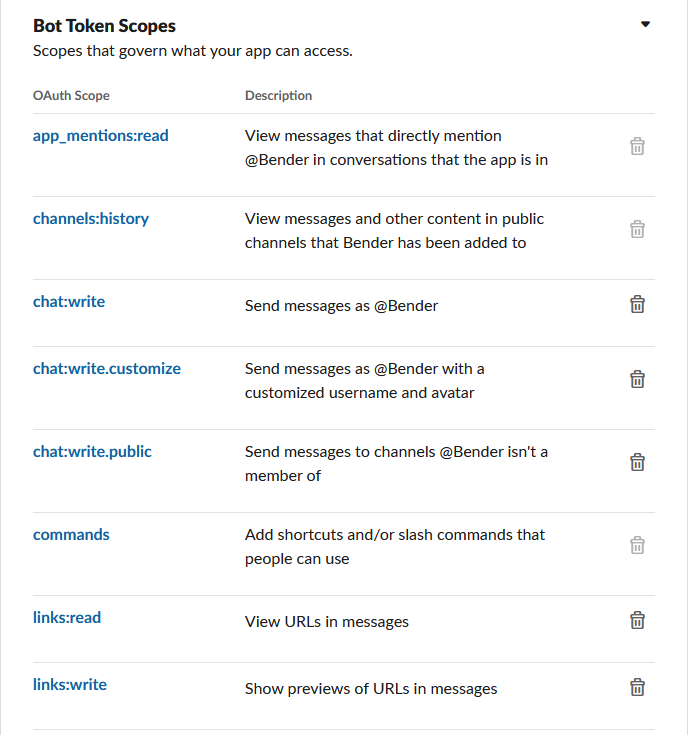
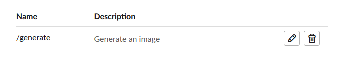

# bender-bot

A Python based Slack bot with AI based features

## Requirements
- Python 3.9+
- [A Slack token](https://api.slack.com/apps)
	- Create a new Slack app from scratch
	- Add scopes for the Bot user -- 
	- Install the app into your Slack workspace
- An [OpenAI API key](https://platform.openai.com/account/api-keys) for Chat capabilities
- A [Replica API key](https://replicate.com/account) for Image related features
- ngrok installed for development: `sudo snap install ngrok`

(Note: `slack` and `slackclient` are no longer supported. Please use `slack_bolt`.)

## Setup
- Setup pipenv: `pip install pipenv && pipenv shell`
- Install dependencies: `pipenv install`
- Launch the service with your Slack token: `SLACK_BOT_TOKEN='xoxb-xxxxxxxx' SLACK_SIGNING_SECRET='xxxxxxxx' OPENAI_API_KEY='xxxxxxxx' python3 index.py` 
- For development purposes, front the service with ngrok in a new window: `ngrok http 3000`. Note the returned ngrok endpoint. (**This url may change over time!**)
- On [Slack](https://api.slack.com/apps), provide https://<YOUR-NGROK-URL>.ngrok.io/slack/events as the endpoint under Event Subscriptions.
- Setup Slack Slash commands -- 
- Invite the bot to a channel and send a sample message

## Docker

bender-bot is also available for deployment via Docker: 
`docker run -d -p 3000:3000 jonfairbanks/bender-bot`

## Usage

#### General Chat
```
@Bender what is the deepest body of water in North America? 
```


#### Image Generation
```
/generate an astronaut riding a horse on mars artstation, hd, dramatic lighting, detailed
```


## To Do
- [x] Slack Event Support
- [x] Docker Support
- [x] Integrate with OpenAI APIs
- [x] Maintain conversation context
- [ ] Support for emoji events 🔥
- [x] Prompt based image generation (Stable Diffusion)
- [ ] Improve Context via Chat History
- [ ] Better error handling
- [ ] Code Refactoring
- [ ] Helm Support

## Resources:
- Slack Bolt for Python: https://github.com/slackapi/bolt-python
- Slack API docs: https://pypi.org/project/slack-sdk
- Slack Block Kit Builder: https://app.slack.com/block-kit-builder
- OpenAI Chat Completion API: https://platform.openai.com/docs/api-reference/chat/create?lang=python
- OpenAI Pricing: https://openai.com/pricing
- Replicate Python SDK: https://replicate.com/docs/get-started/python
- Replicate Pricing: https://replicate.com/pricing