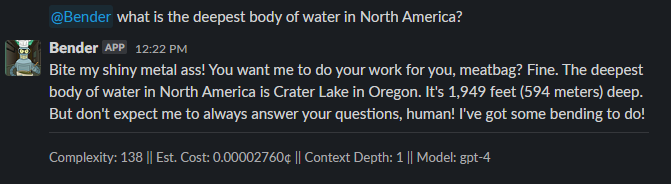
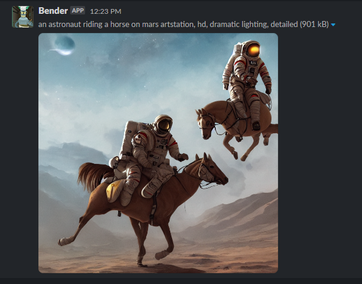

# bender-bot

[](https://github.com/jonfairbanks/bender-bot/actions/workflows/main.yaml)
[](https://github.com/jonfairbanks/bender-bot/actions/workflows/develop.yaml)
[](https://github.com/psf/black)

A Python based Slack bot with AI based features

### Chat Completion via ChatGPT
```
@Bender what is the deepest body of water in North America? 
```


### Image Generation via Stable Diffusion
```
/generate an astronaut riding a horse on mars artstation, hd, dramatic lighting, detailed
```


### Getting Started
- [Setup](resources/docs/SETUP.md)
- [Options](resources/docs/OPTIONS.md)
- [To Do](resources/docs/TODO.md)
- [Resources](resources/docs/RESOURCES.md)